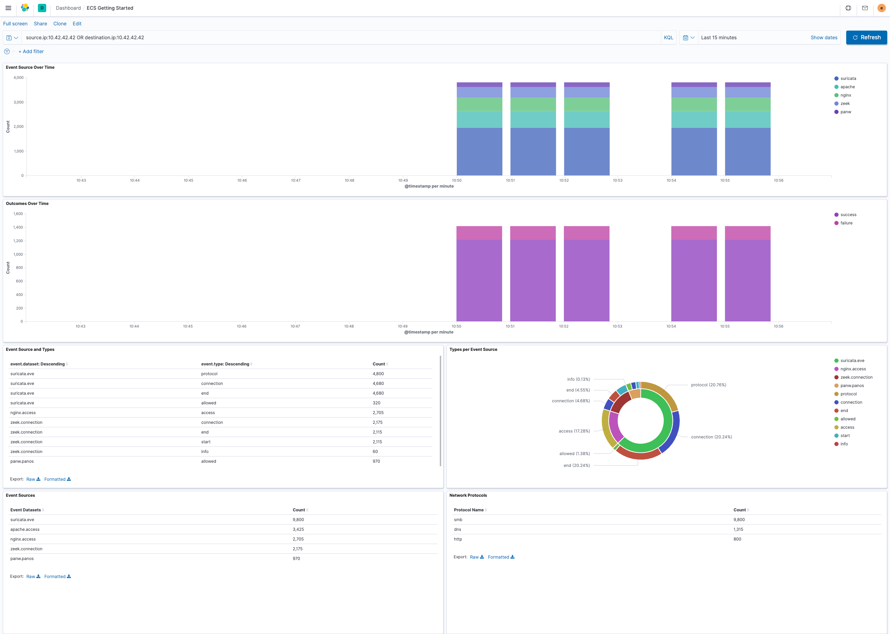

---
mapped_pages:
  - https://www.elastic.co/guide/en/ecs/current/ecs-getting-started.html
applies_to:
  stack: all
  serverless: all
---

# Getting started [ecs-getting-started]

ECS enables and encourages users to normalize event data in order to better analyze, visualize, and correlate their events. Collected events can be normalized at ingest time, consistently searched across indices, and visualized predictably.

Note that when adopting an Elastic solution, such as [Observability](https://www.elastic.co/observability) or [Security](https://www.elastic.co/security), all events will map to ECS out of the box. Elastic provides an extensive set of [integrations](https://www.elastic.co/integrations) to simplify ingesting your data sources.

If you rely on custom data pipelines and/or building content around specific needs, ECS can still help to alleviate the challenges of searching, analyzing, and visualizing across your data. Let’s see how using a common schema can simplify the search experience, and then take a look at how an event’s contents can be mapped to ECS field sets.


## Simplified search [_simplified_search]

With ECS defining a normalized schema across all of your data sources, querying against those sources is simplified. Consider searching for a particular source IP address prior to adopting ECS. All the various data sources and their field mappings would need to be considered in your query:

```sh
src:10.42.42.42 OR client_ip:10.42.42.42 OR apache.access.remote_ip:10.42.42.42 OR
context.user.ip:10.42.42.42 OR src_ip:10.42.42.42
```

With all sources mapped to ECS, the query becomes much simpler:

```sh
source.ip:10.42.42.42
```

Not only does this simplify writing queries, but saved queries shared with other users become much more obvious. To gain familiarity with ECS fields, you can also take a look at the [*ECS Field Reference*](/reference/ecs-field-reference.md) section.


## Unified visualizations [_unified_visualizations]

With normalized data from different data sources, building insightful visualizations across sources is simple. From a single, centralized dashboard, events from web servers, IDS/IPS devices, and firewalls can be aggregated and visualized, and enhanced with drill-downs, and pivoting for delving into deeper investigations. Centralized monitoring of diverse data sources is straightforward with normalized ECS data.




## Translating data sources [_translating_data_sources]

To align events to ECS, some sort of parsing will usually be necessary to transform the contents of the original event into the relevant ECS fields. Depending on how you’ve designed your Elastic Stack data ingestion pipelines, the amount of work to parse your events will vary.

For example, an Apache web server log event:

```sh
10.42.42.42 - - [15/Jul/2020:20:48:32 +0000] "GET /content HTTP/1.1" 200 2571 "-"
"Mozilla/5.0 (Macintosh; Intel Mac OS X 10_15_4) AppleWebKit/537.36 (KHTML, like Gecko)
Chrome/83.0.4103.106 Safari/537.36"
```

In order to map this event to ECS, the contents of the event is associated with the appropriate ECS fields.

| Field Name | Value |
| --- | --- |
| @timestamp | `2020-07-15T20:48:32.000Z` |
| event.original | 10.42.42.42 - - [15/Jul/2020:20:48:32 +0000] "GET /content HTTP/1.1" 200 2571 "-""Mozilla/5.0 (Macintosh; Intel Mac OS X 10_15_4) AppleWebKit/537.36 (KHTML, like Gecko)Chrome/83.0.4103.106 Safari/537.36 |
| http.request.method | GET |
| http.response.body.bytes | 2571 |
| http.response.status_code | 200 |
| http.version | 1.1 |
| message | GET /content HTTP/1.1" 200 2571 "-" "Mozilla/5.0 (Macintosh; Intel Mac OS X 10_15_4) AppleWebKit/537.36 (KHTML, like Gecko) Chrome/83.0.4103.106 Safari/537.36 |
| source.address | 10.42.42.42 |
| source.ip | 10.42.42.42 |
| url.original | `/content` |
| user_agent.original | `Mozilla/5.0 (Macintosh; Intel Mac OS X 10_15_4) AppleWebKit/537.36 (KHTML, like Gecko) Chrome/83.0.4103.106 Safari/537.36` |

Beyond extracting values that are present in the original event, we also populate other fields to provide additional context about the event itself.

* `ecs.version`: States which version of ECS the ingest pipeline was developed against.
* `event.dataset` and `event.module`: Answers "where is this event from" and are expected to have a hardcoded value per pipeline, per source.
* `event.kind`, `event.category`, `event.type`, and `event.outcome`: The [*ECS Categorization Fields*](/reference/ecs-category-field-values-reference.md) should also be hardcoded using knowledge of each type of event the source emits. The contents of these fields are limited to the specifically allowed values detailed in the ECS documentation.

| Field Name | Value |
| --- | --- |
| ecs.version | 1.5.0 |
| event.module | apache |
| event.dataset | apache.access |
| event.kind | event |
| event.category | [ "network", "web" ] |
| event.type | [ "access" ] |
| event.outcome | success |

Lastly, existing field values can be interpreted or enriched using a processor, with the results populating additional fields in the final event.

* The `user_agent` processor extracts details from the original user agent string, `user_agent.original`.
* IP fields like `source.ip` can provide enrichment using the `geoip` processor to add information about the location and autonomous system number (ASN) associated with an IP address.
* The `registered domain` processor reads a field containing a hostname and writes the registered domain to another field
* Event collectors, such as [Beats](beats://docs/reference/index.md), can enrich each event with metadata from the machine’s hosting provider (cloud) and/or from the host machine (host).

Here are some examples of additional fields processed by metadata or parser processors.

| Field Name | Value | Processor |
| --- | --- | --- |
| host.architecture | x86_64 | `add_host_metadata` |
| host.hostname | mbp.example.com | `add_host_metadata` |
| host.ip | [ "192.168.1.100" ] | `add_host_metadata` |
| host.os.family | darwin | `add_host_metadata` |
| host.os.kernel | 19.4.0 | `add_host_metadata` |
| host.os.name | Mac OS X | `add_host_metadata` |
| host.os.version | 10.15.4 | `add_host_metadata` |
| user_agent.name | Chrome | `user_agent` |
| user_agent.os.full | Mac OS X 10.15.4 | `user_agent` |
| user_agent.os.name | Mac OS X | `user_agent` |
| user_agent.os.version | 10.15.4 | `user_agent` |
| user_agent.version | 83.0.4103.106 | `user_agent` |


## Field mapping reference guides [_field_mapping_reference_guides]

We’ve covered at a high level how to map your events to ECS. Now if you’d like your events to render well in the Elastic solutions, check out the reference guides below to learn more about each:

* [Log monitoring field reference](docs-content://reference/observability/fields-and-object-schemas/logs-app-fields.md)
* [Metrics monitoring field reference](docs-content://reference/observability/fields-and-object-schemas/metrics-app-fields.md)
* [Elastic Security field reference](docs-content://reference/security/fields-and-object-schemas/siem-field-reference.md)

