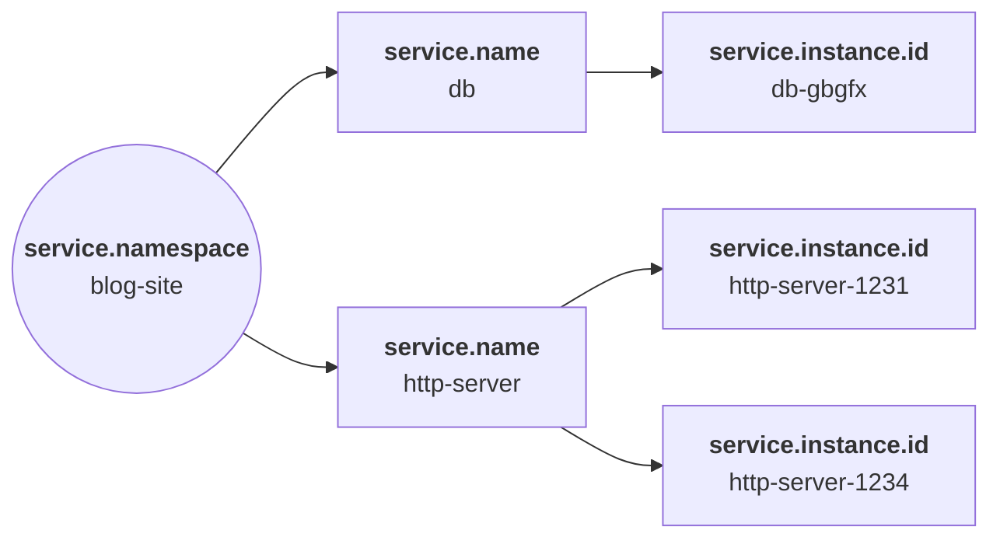

# 0057: Service Namespace Field

- Stage: **Proposal**
- Date: **TBD**
- Target maturity: **beta**

## Summary

Add `service.namespace` to the service fieldset as a keyword field that groups related `service.name` values under a common owner, such as a team, product line, or business unit. This mirrors OpenTelemetry's `service.namespace` resource attribute, a stable semantic convention that, together with `service.name` and `service.instance.id`, forms the triplet used to identify a service instance. ECS already has equivalents for the other two (`service.name`, and `service.node.name` as the equivalent of `service.instance.id`), so this closes the remaining gap. Today, teams either invent a custom field for this or repurpose `service.type`, which describes what kind of service something is, not who owns it, and can't take on a grouping role without breaking its documented meaning.

## Usage

OpenTelemetry's docs illustrate the relationship between the three identity attributes with this diagram:



`service.namespace` sits above `service.name`: one `blog-site` namespace owns two named services, `db` and `http-server`, and each of those can run multiple instances. ECS already covers the bottom of that hierarchy: `service.name` for the named service, `service.node.name` for the running instance (already tagged `otel: equivalent` to `service.instance.id` in `schemas/service.yml`). There's currently no field for the outer grouping.

In practice that grouping tends to follow team or product boundaries rather than technical ones. A platform team running twenty microservices under distinct `service.name` values wants a single filter, `service.namespace: payments`, that returns everything they own, instead of an OR clause listing every name or a saved list that goes stale every time a service is added or renamed. The same field supports:

- Service maps and dashboards that roll instances up to services and services up to namespace, matching the shape of the diagram above.
- Scoping alerts or detection rules to a team's services without hardcoding a name list.
- Access control, so a team can be granted visibility into only the namespaces they own.
- Disambiguating `service.name` values that repeat across groups. Two teams both naming a service `worker` is common; `service.namespace` tells them apart, the same way OTel uses it.

It also gives a destination for the `service.namespace` resource attribute that OTel SDKs and EDOT distributions already emit under the semantic convention, which today has no corresponding ECS field to land in.

## Fields

The proposed field definition is in [`rfcs/text/0057/service.yml`](./0057/service.yml), inserted alphabetically after `name`:

```yaml
- name: namespace
  level: extended
  type: keyword
  short: Namespace grouping service.name values by team, product, or business unit.
  beta: This field is beta and subject to change.
  example: shop
  description: >
    A namespace for `service.name`.

    Namespace distinguishes a group of related services, for example
    the team, product line, or business unit that owns them. Unlike
    `service.name`, which identifies one service, `service.namespace`
    identifies the group it belongs to. This lets services be
    filtered, dashboarded, or access-controlled by owning group rather
    than by individual name, and disambiguates `service.name` values
    that are reused across different groups.

    `service.namespace` is independent of `service.environment`.
    Namespace identifies who owns a service; environment identifies
    which deployment stage a running instance is in. The two can be
    combined, for example the same namespace running in both
    `production` and `staging`.
  otel:
    - relation: match
```

`level: extended` matches the other optional, not-always-populated fields in this set (`environment`, `node.name`). `service.name` and `service.type` stay `core` because they're expected on effectively every service-scoped event; `service.namespace` is metadata a producer opts into, the same reasoning behind `environment` being `extended` rather than `core`.

Because the field is added to the base `service` group, it's automatically available wherever `service.*` is reused, including `service.origin.namespace` and `service.target.namespace`, with no additional schema work.

## Source data

### OTel SDK / EDOT resource attributes

An OTel or EDOT-instrumented service configured with `OTEL_RESOURCE_ATTRIBUTES=service.name=checkout,service.namespace=shop,service.instance.id=checkout-7f8b6d4d59-abc12` reports these as OTLP resource attributes:

```json
{
  "resource": {
    "attributes": [
      { "key": "service.name", "value": { "stringValue": "checkout" } },
      { "key": "service.namespace", "value": { "stringValue": "shop" } },
      { "key": "service.instance.id", "value": { "stringValue": "checkout-7f8b6d4d59-abc12" } },
      { "key": "service.version", "value": { "stringValue": "2.4.1" } }
    ]
  }
}
```

This is a direct match: `service.namespace` maps straight across, alongside the existing `service.name` and `service.node.name` (from `service.instance.id`) mappings.

### Kubernetes namespace as team boundary

Many platform teams already run one Kubernetes namespace per team or product, so `kubernetes.namespace` (already collected by Elastic Agent's Kubernetes integration) is a natural, low-effort source. A pipeline processor can copy it across without touching the integration's existing fields:

```json
{
  "kubernetes": {
    "namespace": "payments",
    "deployment": { "name": "invoice-service" },
    "pod": { "name": "invoice-service-6c5f9c8d9b-h2xkq" }
  },
  "service": {
    "name": "invoice-service",
    "namespace": "payments",
    "node": { "name": "invoice-service-6c5f9c8d9b-h2xkq" }
  }
}
```

### AWS ECS task tags

Teams running on AWS ECS/Fargate commonly tag tasks with an internal ownership or cost-allocation tag. Normalizing Container Insights or CloudWatch data can map that tag to `service.namespace`:

```json
{
  "aws": {
    "ecs": {
      "cluster.name": "prod-checkout",
      "task.family": "checkout-worker",
      "task.tags": { "team": "payments", "cost-center": "CC-4471" }
    }
  },
  "service": {
    "name": "checkout-worker",
    "namespace": "payments"
  }
}
```

## Scope of impact

**Ingestion:** Purely additive. No existing Elastic integration currently populates this field, so nothing changes for producers that don't set it. Populating it takes one of two paths: OTel/EDOT ingestion, where the semantic convention attribute maps straight across, or a small pipeline addition in Beats/Elastic Agent integrations that copies an existing metadata value (Kubernetes namespace, a cloud resource tag, and so on) into `service.namespace`. Because it's added to the base `service` group, it's also available at `service.origin.namespace` and `service.target.namespace` automatically.

**Usage:** Kibana's Service Map, APM inventory views, and team-scoped dashboards or detection rules gain a native field to filter and group by, instead of a custom or vendor-specific one. Nothing existing needs to change, since the field is new and optional.

**ECS project:** One field addition to `schemas/service.yml` at beta maturity, plus generated artifacts and docs at implementation time. No renames, deprecations, or changes to the existing `service` reuse list.

## Concerns

**Isn't this what `service.type` is for?** No, and it's worth spelling out since it's the workaround teams already reach for. `service.type` captures what kind of service something is, `elasticsearch`, `nginx`, `nodejs`, so every Elasticsearch cluster in a fleet shares the same `service.type` regardless of which team runs it ([#142](https://github.com/elastic/ecs/issues/142) covers the original design discussion, and the [field is documented](https://www.elastic.co/docs/reference/ecs/ecs-service#field-service-type) the same way today). Grouping by ownership needs the opposite property: one namespace like `payments` typically contains several different `service.type` values, a Node.js API, a Postgres database, a Redis cache, all owned by the same team. Overloading `type` to also carry a grouping role would break that assumption for anyone already using it as documented.

Some teams already repurpose `service.type` for grouping because nothing else fits, and that's a legitimate workaround if `type` isn't otherwise in use. But it stays a workaround, not a fix: the moment that team also needs to distinguish actual service types, the field can't do both jobs at once. `service.namespace` gives the grouping use case its own field instead.

**What about reusing `group.*`?** `group.*` models POSIX-style group membership (gid, user and process group), and its `reusable.expected` list in `schemas/group.yml` only covers `user` and `process`, not `service`. It also means something different: a Unix group has members with permissions, not a named set of services owned by a team. This exact question came up in [#508](https://github.com/elastic/ecs/issues/508), where the best available advice at the time was `group.*` or custom fields, and neither approach stuck.

**Does this overlap with `service.environment`?** No, the two are orthogonal. `environment` answers which deployment stage an instance is running in; `namespace` answers who owns the service. The same namespace spans environments (`payments` running in both `staging` and `production`), and the same environment spans namespaces (`production` holding every team's services). Both can be set on the same event.

**Does the name collide with `data_stream.namespace`?** Only in the two words. `data_stream.namespace` is Elastic's own data-routing concept, part of the `type-dataset-namespace` convention for naming a data stream's backing indices, and defaults to `default`. `service.namespace` is the OTel service-grouping concept. They sit in different fieldsets, serve different purposes, and are always fully qualified in queries, so there's no technical conflict. It's worth a documentation note so nobody assumes `service.namespace` inherits `data_stream.namespace`'s default value or behavior.

**Should ECS enforce the namespace/name/instance-id uniqueness OTel describes?** No. The OTel spec expects the triplet of `service.namespace`, `service.name`, and `service.instance.id` to be globally unique, but ECS doesn't enforce uniqueness on any identifier field at the schema level (`service.id` and `service.node.name` don't either). That stays the producer's responsibility. It's noted here so implementers understand the intent, not as a validation requirement on the field.

**Why beta instead of alpha?** The field's shape and meaning are already settled: it's a direct, single-value match to an OTel attribute that's been stable across several spec releases, not a new concept ECS is defining from scratch. What's missing is population by Elastic integrations, not definition, which is the same reasoning [RFC 0055](./0055-vulnerability-status.md) used for `vulnerability.status`. Beta signals the field is stable enough to build against while integration coverage catches up.

## People

* @adrianchen-es | author

## References

- [OpenTelemetry semantic conventions: Service](https://opentelemetry.io/docs/specs/semconv/resource/service/#service-namespace)
- [ECS docs: `service.type`](https://www.elastic.co/docs/reference/ecs/ecs-service#field-service-type)
- [#142](https://github.com/elastic/ecs/issues/142) - original `service.type` vs. `service.name` design discussion
- [#508](https://github.com/elastic/ecs/issues/508) - prior request for a service organizational hierarchy in ECS
- [RFC 0055 - Vulnerability Status Field](./0055-vulnerability-status.md) - precedent for beta maturity on a field matching an established external concept
- [ECS RFC process](https://github.com/elastic/ecs/blob/main/rfcs/PROCESS.md)

### RFC Pull Requests

* Proposal: https://github.com/elastic/ecs/pull/2680
